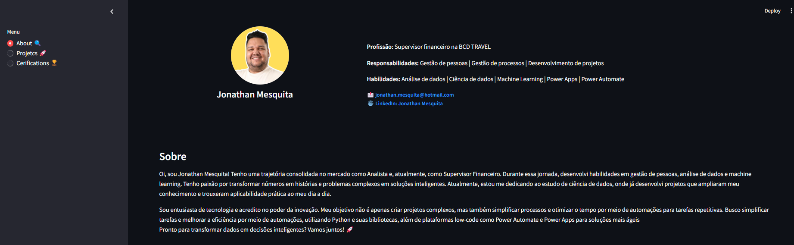
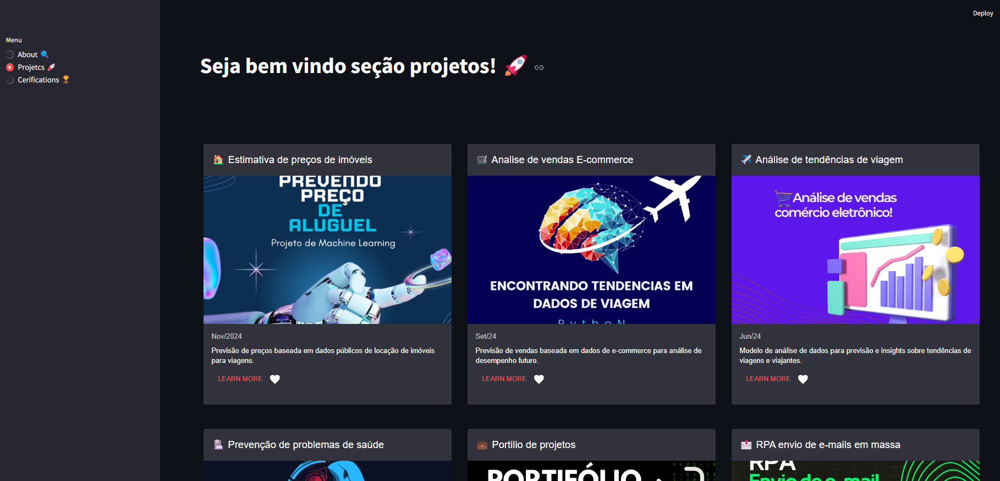
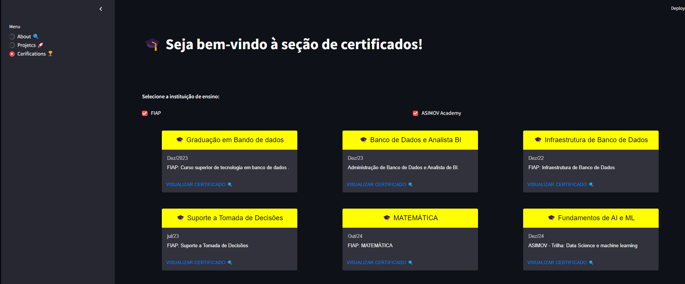

# 📊 Portfólio de Projetos de Ciência de Dados

Bem-vindo ao meu portfólio de projetos de Ciência de Dados! Aqui você encontrará uma coleção dos meus trabalhos, desde análises exploratórias até modelos de machine learning. Este portfólio foi desenvolvido usando Streamlit, uma ferramenta incrível para criar aplicativos web interativos com Python.

## 🚀 Como Executar o Projeto

Para rodar este projeto localmente, siga os passos abaixo:

### Clone o repositório:
```bash
git clone https://github.com/seu-usuario/seu-repositorio.git
cd seu-repositorio
```

### Crie um ambiente virtual (recomendado):
```bash
python -m venv venv
```

### Ative o ambiente virtual:
**No Windows:**
```bash
venv\Scripts\activate
```

**No macOS/Linux:**
```bash
source venv/bin/activate
```

### Instale as dependências:
```bash
pip install -r requirements.txt
```

### Execute o aplicativo Streamlit:
```bash
streamlit run main.py
```

### Acesse o aplicativo:
Abra o navegador e acesse o endereço indicado no terminal (geralmente `http://localhost:8501`).

## 🛠️ Tecnologias Utilizadas

- **Streamlit**: Para criar a interface web interativa.
- **Streamlit Elements**: Para componentes personalizados, como cards e layouts avançados.
- **Python**: Linguagem principal do projeto.

## 📂 Estrutura do Projeto
```bash
seu-repositorio/
├── main.py              # Arquivo principal do Streamlit
├── about.py             # Lógica da seção "Sobre"
├── projects.py          # Lógica da seção "Projetos"
├── certifications.py    # Lógica da seção "Certificados"
├── utils.py             # Funções utilitárias (ex: carregar imagens)
├── assets/              # Pasta para armazenar imagens e outros recursos
│   └── imagens/         # Imagens usadas no projeto
├── requirements.txt     # Lista de dependências
└── README.md            # Este arquivo
```

## 🎯 Seções do Portfólio

### 1. Sobre
- Breve descrição sobre mim, minha experiência e habilidades.
- Links para contato (e-mail, LinkedIn, etc.).

### 2. Projetos
- Cards interativos com detalhes sobre cada projeto.
- Inclui título, descrição, data e link para o repositório ou demonstração.

### 3. Certificados
- Lista de certificados obtidos, organizados por instituição (ex: FIAP, ASIMOV Academy).
- Links para visualizar os certificados.

## 📸 Capturas de Tela
Aqui estão algumas capturas de tela do projeto:

**Página Inicial**



**Seção de Projetos**



**Seção de Certificados**



## 📝 Licença
Este projeto está licenciado sob a licença MIT. Veja o arquivo LICENSE para mais detalhes.

## 🤝 Contribuições
Contribuições são bem-vindas! Se você tiver sugestões ou encontrar algum problema, sinta-se à vontade para abrir uma issue ou enviar um pull request.


## 🙏 Agradecimentos
- À comunidade Streamlit por fornecer uma ferramenta incrível para criar aplicativos web.
- Aos instrutores e colegas que me ajudaram a aprender e evoluir na área de Ciência de Dados.
